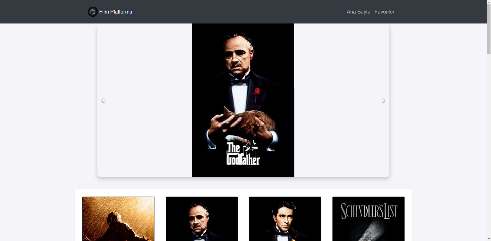
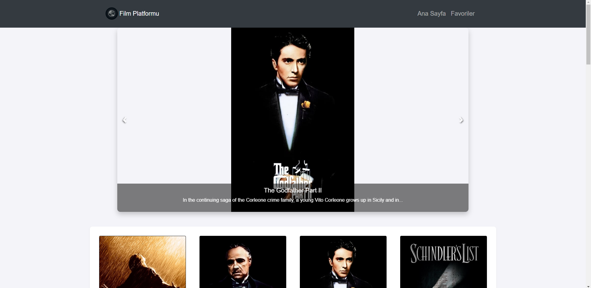
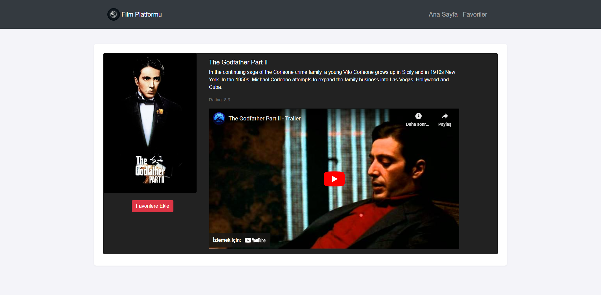
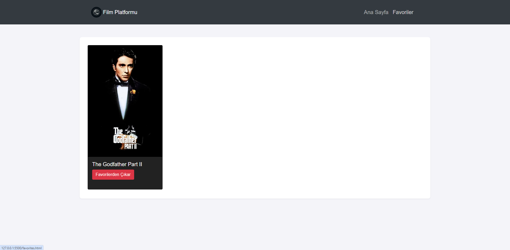

# Film Platformu

## 🌐 English
The Film Platformu project is a dynamic web application that offers users the ability to discover the best movies.

### 🚀 Features
- View top-rated movies.
- Add and remove movies from favorites.
- Detailed movie descriptions.

### 🔗 Live Demo
[Film Platformu Live](https://veccina-movie-app.netlify.app)

### 📸 Screenshots

### 🛠️ Technologies Used

## 🌐 Türkçe
Film Platformu projesi, kullanıcılara en iyi filmleri keşfetme imkanı tanıyan dinamik bir web uygulamasıdır.

### 🚀 Özellikler
- En iyi derecelendirilmiş filmleri görüntüleme.
- Favorilere film ekleme ve çıkarma.
- Detaylı film açıklamaları.

### 🔗 Canlı Demo
[Film Platformu Live](https://veccina-movie-app.netlify.app)

### 📸 Ekran Görüntüleri

### 🛠️ Kullanılan Teknolojiler

